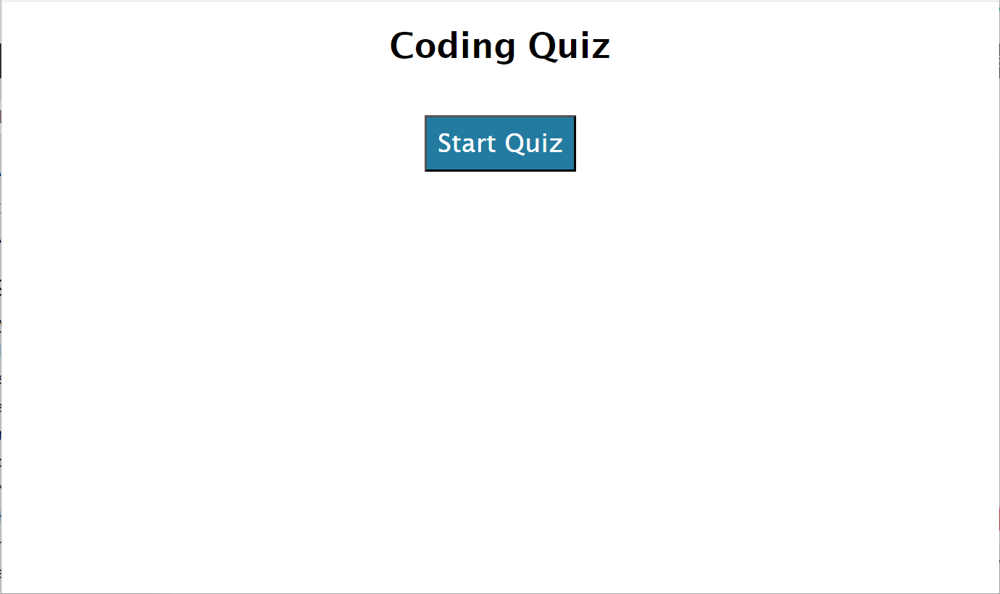
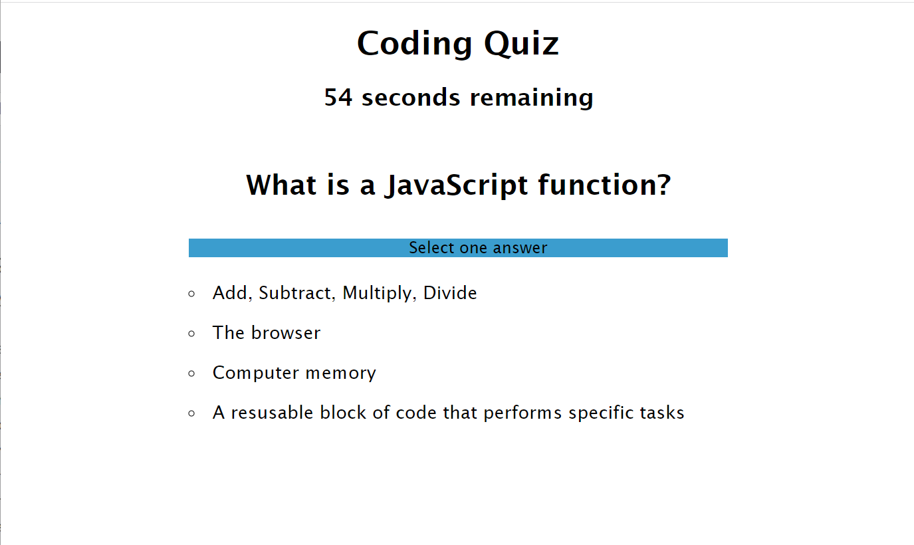
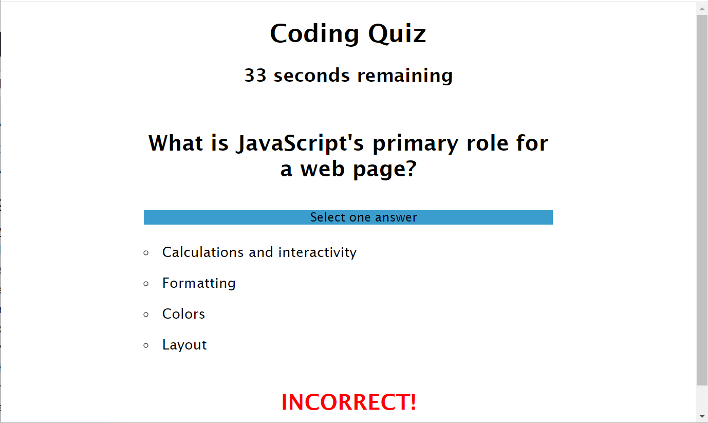
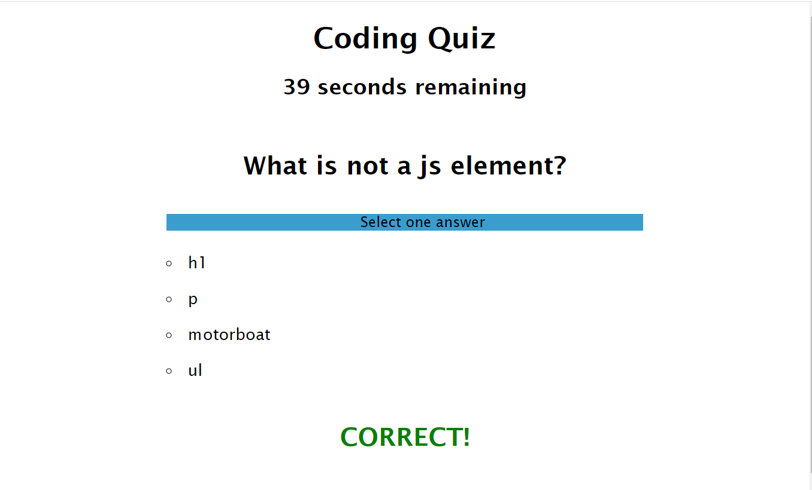
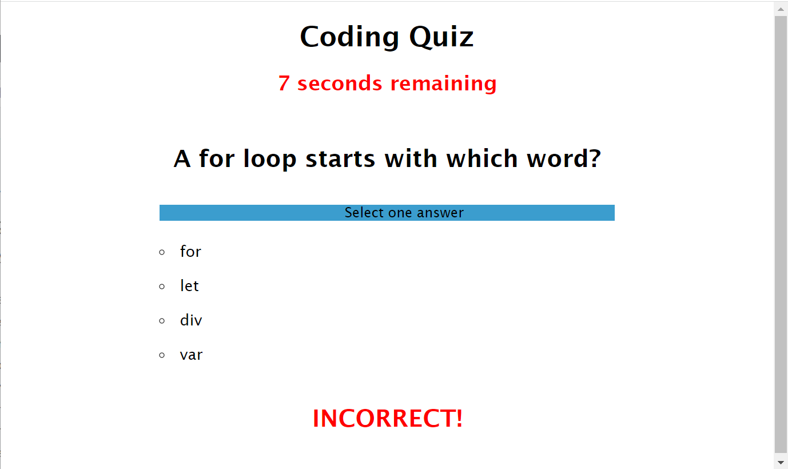
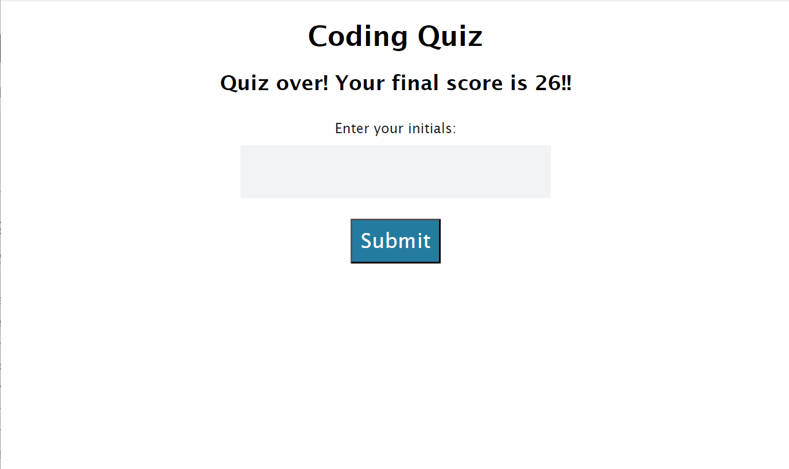
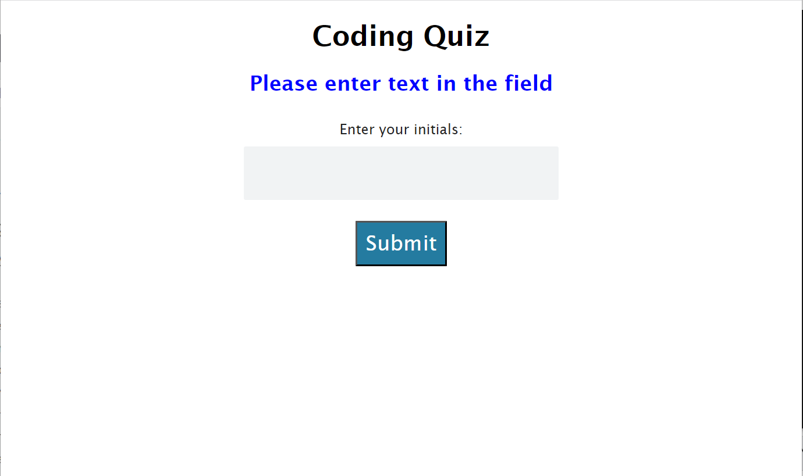
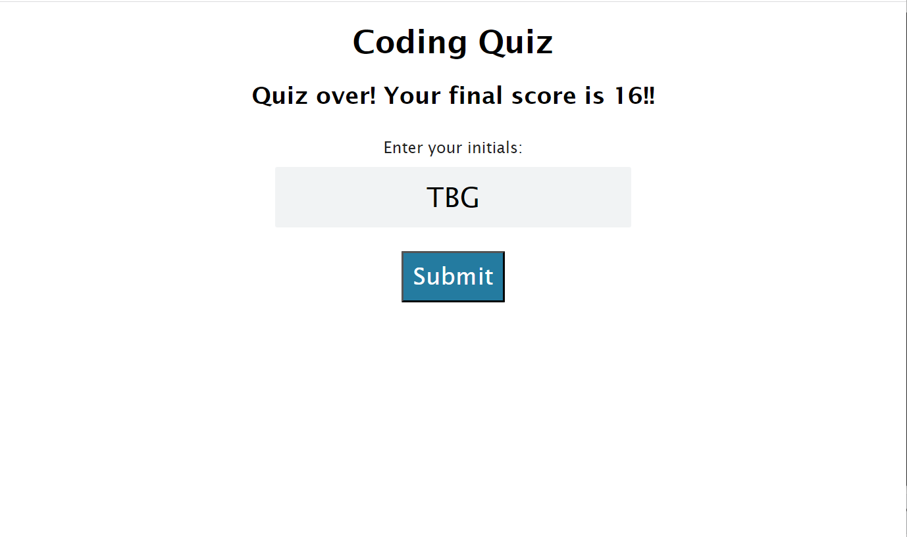
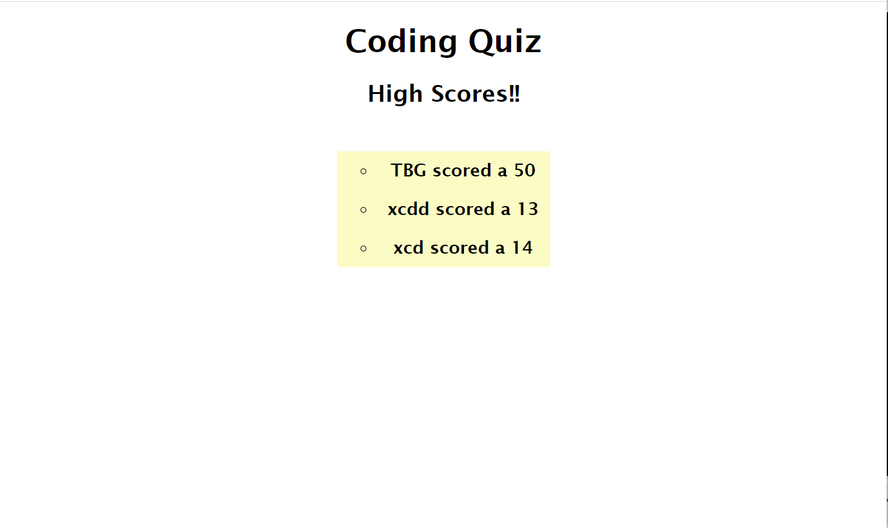

# 04-Coding-Quiz-Project
Rick's coding quiz project

# Challenge-04 - Web APIs - Code Quiz

## Description
The purpose of this project is to build a timed coding quiz with multiple choice questions that will run in the browser and feature dynamically updated HTML and CSS powered by JavaScript code. Acceptance Criteria have been broken down into indidivual features (e.g. AC01). For details on the implementation, review the applicable 'Usage' section of this README.

### User Story

* AS A coding boot camp student
I WANT to take a timed quiz on JavaScript fundamentals that stores high scores
SO THAT I can gauge my progress compared to my peers

### Acceptance Criteria

> * GIVEN I am taking a code quiz
> * AC01: Timer and Quiz Initiation
>    -	WHEN I click the start button
>    -	THEN a timer starts and I am presented with a question    

>* AC02: Next Question Execution
>    -	WHEN I answer a question
>    -	THEN I am presented with another question

>* AC03: Time Penalty
>    -	WHEN I answer a question incorrectly
>    -	THEN time is subtracted from the clock

>* AC04: End Game
>    -	WHEN all questions are answered or the timer reaches 0
>    -	THEN the game is over

>* AC05: Post-Game Actions
>    -	WHEN the game is over
>    -	THEN I can save my initials and my score

## Installation

> * To launch the webpage, open the browser and paste the following URL in the address bar: https://recenasu.github.io/04-Coding-Quiz-Project/
> * To access the project repo, open the browser and paste the following URL in the address bar: https://github.com/recenasu/04-Coding-Quiz-Project

## Usage

> * From the webpage, click on the Start Quiz button. The first question is displayed, along with a 60-second timer that will start to countdown (AC01). The object is to answer all of the questions as quickly as possible. Your final score will be the number of seconds remaining when you complete the quiz.

> * Choose the best answer by clicking on it. If you answered correctly, CORRECT will be displayed. If you answered incorrectly, INCORRECT will be displayed and the countdown timer will be decremented by 10 additional seconds (AC03). The quiz will then continue to the next question (AC02).

> * The quiz is done when you have answered all questions or the timer has reached 0 (AC04). When there are less than 10 seconds remaining, the countdown timer will change to red text.

> * When the quiz is finished, your high score will be displayed, along with a text entry box. Entering your initials and clicking the Submit button saves your initials and score and then displays the last three saved scores (AC05). If you click Submit without entering a value, a message will prompt you to enter text in the field.

> * To run the program again, refresh the webpage.

The following images show the application sequence.

## Credits

N/A

## License

N/A

## Tests

>1. Open Google Chrome and navigate to https://recenasu.github.io/04-Coding-Quiz-Project/
>2. Click the "Start Quiz" button.
>3. Select and answer for each question presented.
>4. Confirm that when a correct answer is chosen, "CORRECT" is displayed in green text.
>5. Confirm that when an incorrect answer is chosen, "INCORRECT" is displayed in red text and the timer decrements by 10 additional seconds. 
>6. At the end of the quiz, view your score.
>7. Enter your initials in the text entry field.
>8. Click Submit.
>9. View the last three scores. 
>10. Confirm your score is the top entry.
>11. If desired, refresh the webpage to take the quiz again. 

